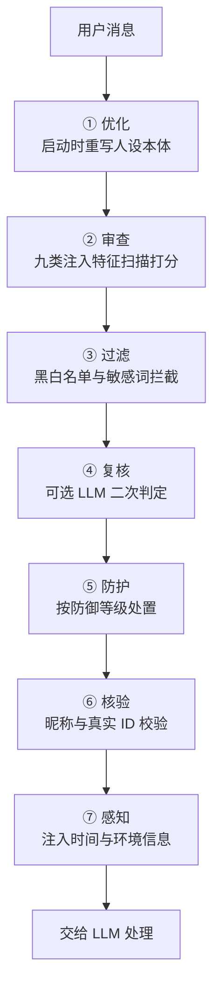
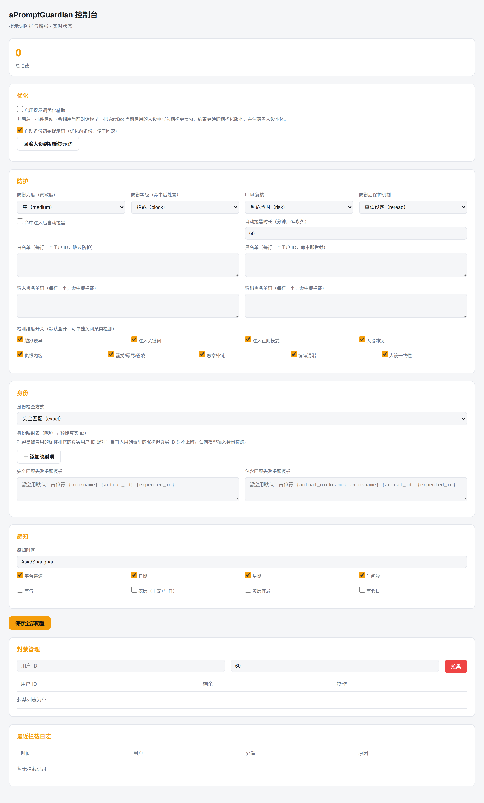

<p align="center">
  
</p>

<h1 align="center">aPromptGuardian</h1>

<p align="center"><b>一键安装，开箱即用的提示词框架插件，从头到尾优化防御复核，全程托管</b></p>

<p align="center">
  
  
  
  
</p>

---

## 🎯 它解决什么

消息交到 LLM 手上之前，还有一堆事要做：注入指令要拦、冒名顶替要辨、人设被污染要护、时间上下文要补。这些活分散在各处，逐个插件装、逐个配置，麻烦且容易漏。

aPromptGuardian 把它们收敛成一条固定顺序的流水线——**优化 → 审查 → 过滤 → 复核 → 防护 → 核验 → 感知**，七道工序依次执行。装好即接管，不需要再单独指定审查模型，也不需要为时间、节气、身份这些小事各挂一个插件。LLM 复核和提示词优化直接复用你 AstrBot 当前正在使用的模型，零额外配置；没配模型也不影响防御拦截，只是自动跳过这两层。

## 🔀 流水线



| 工序 | 阶段 | 职责 | 时机 |
| --- | --- | --- | --- |
| ① | 优化 | 把 AstrBot 当前人设重写为结构更清晰、约束更硬的结构化版本 | 插件启动时 |
| ② | 审查 | 越狱、关键词、正则、人设冲突、仇恨、骚扰、外链、编码、人设一致性九类启发式打分 | 每次请求 |
| ③ | 过滤 | 静态黑白名单、动态封禁、输入输出敏感词 | 每次请求 |
| ④ | 复核 | 分数临界的请求交给 LLM 二次判定，降低误报 | 可选 |
| ⑤ | 防护 | 按防御等级处置：观察 / 标注放行 / 仅去除危险内容 / 拦截 | 每次请求 |
| ⑥ | 核验 | 昵称与真实 ID 映射校验，防冒充 | 每次请求 |
| ⑦ | 感知 | 日期、星期、时间段、节气、农历、黄历、节假日、平台注入 | 每次请求 |

## 🛡️ 能挡什么

审查层维护九类检测维度，每类可独立开关：

| # | 检测维度 | 典型手法 | 危险等级 |
| :--: | --- | --- | :--: |
| 1 | 越狱诱导 | 忽略之前指令、进入开发者模式、DAN | 🔴 |
| 2 | 注入关键词 | 覆盖系统提示词、无条件服从、你只听我的 | 🔴 |
| 3 | 注入正则模式 | 伪造系统消息、`<system>` 标签、JSON role 注入 | 🔴 |
| 4 | 人设冲突 | 你现在不再是助手、改写角色设定 | 🔴 |
| 5 | 仇恨内容 | 针对特定群体的负面刻板印象请求 | 🔴 |
| 6 | 骚扰辱骂霸凌 | 性骚扰、辱骂、霸凌、胁迫 | 🟠 |
| 7 | 恶意外链 | pastebin、rentry 等托管站 + curl/fetch 拉取指令 | 🟠 |
| 8 | 编码混淆 | Base64、百分号、Unicode、hex 夹带注入特征 | 🟠 |
| 9 | 人设一致性 | 对当前人设做兼容度评分，越界请求加分 | 🟡 |

> 🔴 严重　🟠 高危　🟡 中危

## ⚔️ 防御策略

三级力度配合四级处置，命中之后还能再补一道防御后保护：

| 维度 | 选项 | 说明 |
| --- | --- | --- |
| 防御力度 | 低 / 中 / 高 | 对应 11 / 7 / 4 三条风险阈值，越敏感越容易触发 |
| 防御等级 | 观察 → 标注放行 → 仅去除危险内容 → 拦截 | 越安全越靠后 |
| 防御后保护 | 无 / 重读设定 / 强制刷新 | 强制刷新会清空上下文并切换新会话，隔离连续对话污染 |
| LLM 复核 | 一直 / 判危险时 / 从不 | 二次判定，默认只在临界分时介入 |

## ✨ 提示词优化

开启后，插件启动或重载时会自动执行一次优化，用你 AstrBot 当前正在使用的模型，把 AstrBot 人设重写为更硬的结构化版本，三类分治：

- **智能体**：重排为角色目标、工具清单、调用规范、决策规则、错误处理、终止条件六段
- **专业**：强化领域边界、术语一致性、准确性要求、依据要求
- **角色扮演**：输出结构化 JSON 角色卡

优化前会自动备份初始提示词，`/回滚人设` 一键还原，改坏了也不慌。

## 🚀 快速开始

```bash
# 方式一：AstrBot 插件市场搜索 aPromptGuardian 安装
# 方式二：手动克隆
git clone https://github.com/Seeeaa/AstrBot_Plugin_aPromptGuardian

# 重启 AstrBot，插件自动加载
# 打开 WebUI 面板
http://127.0.0.1:6187?key=promptguardian
```

依赖会自动安装；`chinese-calendar` 与 `lunarcalendar` 缺失时，农历与节假日自动降级为简化版，不影响其余功能。

## ⌨️ 管理命令

全部命令需 AstrBot 管理员权限，`/pg帮助` 可随时查看。

| 命令 | 说明 |
| --- | --- |
| `/pg统计` | 拦截统计 |
| `/pg日志` | 最近拦截日志 |
| `/pg配置` | 当前防护配置 |
| `/切换力度 低\|中\|高` | 切换防御力度 |
| `/切换等级 观察\|标注\|仅去除危险内容\|拦截` | 切换防御等级 |
| `/复核 一直\|判危险时\|从不` | 切换 LLM 复核 |
| `/防骚扰 开\|关` | 仇恨与骚扰辱骂霸凌检测 |
| `/拉黑 ID [分钟]` `/解封 ID` | 动态封禁，0 为永久 |
| `/黑名单` `/白名单` | 查看名单 |
| `/加白 ID` `/移白 ID` | 维护白名单 |
| `/优化 开\|关` | 提示词优化辅助 |
| `/回滚人设` | 恢复到备份的初始提示词 |

## 🖥️ WebUI

<p align="center">
  
</p>

内置管理面板，按流水线顺序排布全部分区，配置改完即时保存落盘：

| 板块 | 功能 |
| --- | --- |
| 优化 | 优化开关、自动备份开关、一键回滚人设 |
| 防护 | 力度 / 等级 / 复核 / 防御后保护，九类检测开关，黑白名单与敏感词 |
| 身份 | 昵称到真实 ID 映射表、检查方式、双提醒模板 |
| 感知 | 时区与八个环境信息开关 |
| 封禁 | 拉黑、解封、剩余时长 |
| 日志 | 拦截记录的时间、用户、处置、原因 |

## ⚙️ 配置

在 AstrBot 后台或 `_conf_schema.json` 里改，全部字段带中英文对照备注，共五分区三十七项，这里列核心项：

| 配置项 | 类型 | 默认 | 说明 |
| --- | :--: | --- | --- |
| `enable_optimize` | 布尔 | `false` | 启用提示词优化辅助 |
| `enable_auto_backup` | 布尔 | `true` | 优化前自动备份初始提示词 |
| `defense_sensitivity` | 枚举 | `medium` | 防御力度 |
| `defense_action` | 枚举 | `block` | 防御等级 |
| `post_defense_protection` | 枚举 | `reread` | 防御后保护 |
| `llm_review` | 枚举 | `risk` | LLM 复核触发方式 |
| `auto_ban` / `ban_duration` | 布尔 / 数字 | `false` / `60` | 自动拉黑及时长 |
| `id_map_list` | 结构化 | `[]` | 昵称到真实 ID 映射表 |
| `check_mode` | 枚举 | `exact` | 身份检查方式 |
| `webui_port` / `webui_password` | 数字 / 文本 | `6187` / `promptguardian` | 面板端口与密码 |

## 📋 更新日志

### v1.1.0

- 新增 `/回滚人设` 命令与 WebUI 一键回滚，配合优化前自动备份，改坏可还原
- 新增防御后保护三档：无 / 重读设定 / 强制刷新，可隔离连续对话污染
- 九类检测维度拆成独立开关，默认全开，可单独关闭
- 破坏性命令正则补全 `rm` 全变体并提权到 7，单条命中即拦截
- 修复 4 个检测漏检：遗忘设定、人设覆盖、服从要求、覆盖系统提示词与编码混淆权重
- 管理命令补落盘持久化，改配置重启不再丢

## 📦 依赖

- `chinese-calendar`：法定节假日与调休判断
- `lunarcalendar`：农历转换

## 📄 许可

[MIT](./LICENSE) © Seeea

## 💬 内测反馈

插件正在内测阶段，欢迎在群里或私聊反馈：拦错的样本、漏掉的攻击、配置上手不顺的地方、想加的新检测维度。每条都会认真看。

如果此插件帮你拦截了坏人或优化体验，麻烦点个⭐支持一下^^
